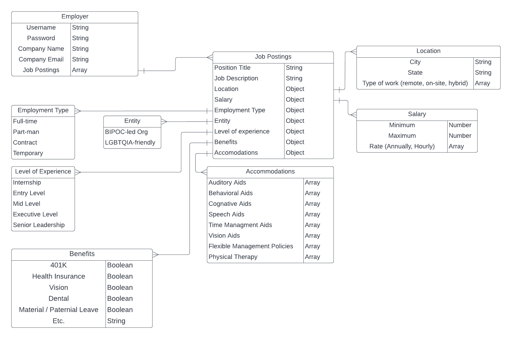

<h1>Invisible Strengths</h1>
<h2>Description</h2>
Group 1 was assigned to create an API from the point of view of a company who posts jobs on Invisible Strengths. In this project, we allow a company to post a job with required fields for the job seeker to either type in or choose. They (the job poster) can make job postings using CRUD functionality. 


<h2>Technologies Used</h2>

<ul>
<li>MongoDB</li>
<li>Express</li>
<li>Node.js</li>
<li>JavaScript</li>
<li>POSTMAN</li>
</ul>

<h2>API</h2>
For this project, we used POSTMAN to interact with our API. On POSTMAN, we can create, add, update and delete data with the model fields and will appear on the web browser.

<h2>ERD and models</h2>




```
models
|- Employer
|- Job Posting
|- Location
|- Salary
|- Employment Type
|- Level of Experience
|- Benefits
|- Entity
|- Accomondations
|- Database
```

<h2>Controllers</h2>

```
controller
|- Route
|- Database
|- Search
|- API
```

<h2>Basic Functionality and CRUD</h2>
<p>To simplify the code, we separated the error message as its own function to check for errors and if the function returns false, it will move down. We also made the route controller dynamically generate its routes based on the content of the "models" array. </p>

<h3>CREATING</h3>
<p>Route Controller</p>

```
router.post(`/api/${model.name}`, databaseController.create.bind(databaseController), apiController.show.bind(apiController))
```


<p>Data Controller</p>

```
create (req, res, next) {
  this.model.create(req.body, (err, createdDocument) => {
    if (this.errorCheck(err, res) === false) {
      res.locals.data.document = createdDocument
      next()
    }
  })
}
```

<h3>READING</h3>
<p>Route Controller</p>

```
router.get(`/api/${model.name}`, databaseController.index.bind(databaseController), apiController.index.bind(apiController))
```
```
router.get(`/api/${model.name}/:id`, databaseController.show.bind(databaseController), apiController.show.bind(apiController))
```

<p>Data Controller</p>

```
index (req, res, next) {
  this.model.find({}).populate(this.params).exec((err, foundDocuments) => {
    if (this.errorCheck(err, res) === false) {
      res.locals.data.documents = foundDocuments
      next()
    }
  })
}
```
```
show (req, res, next) {
  this.model.findById(req.params.id).populate(this.params).exec((err, foundDocument) => {
    if (this.errorCheck(err, res) === false) {
      res.locals.data.document = foundDocument
      next()
    }
  })
}
```

<h3>UPDATING</h3>

<p>Route Controller</p>

```
router.put(`/api/${model.name}/:id`, databaseController.update.bind(databaseController), apiController.show.bind(apiController))
```

<p>Data Controller</p>

```
update (req, res, next) {
  this.model.findByIdAndUpdate(req.params.id, req.body, { new: true }, (err, updatedDocument) => {
    if (this.errorCheck(err, res) === false) {
      res.locals.data.document = updatedDocument
      next()
    }
  })
}
```

<h3>DELETING</h3>

<p>Route Controller</p>

```
router.put(`/api/${model.name}/:id`, databaseController.update.bind(databaseController), apiController.show.bind(apiController))
```

<p>Data Controller</p>

```
delete (req, res, next) {
  this.model.findByIdAndDelete(req.params.id, (err, deletedDocument) => {
    if (this.errorCheck(err, res) === false) {
      res.locals.data.document = deletedDocument
      next()
    }
  })
}
```


<h2>RESTful Table</h2>

| Action |        URL      | HTTP Verb |     Mongoose Method       |
|--------|-----------------|-----------|---------------------------|
| Index  |    /invisiblestrengths/api/[model]    |  GET      |       models.find()      |
|  Show  | /invisiblestrengths/api/[model]/:id    |  GET      |      models.findById()   |
|Create  |    /invisiblestrengths/api/[model]    |  POST     |  models.create(req.body) |
|Update  | /invisiblestrengths/api/[model]/:id    |  PUT      |models.findByIdAndUpdate()|
|Delete  |    /invisiblestrengths/api/[model]/:id    |  DELETE   |models.findByIdAndDelete()| 

<h2>Next Steps</h2>
<p>The next step for this project is to create the frontend portion of the app. </p>

<h2>Misc</h2>
<a href='https://trello.com/b/N2LRUDar/evelyncohortgroup1project2'>Trello Board</a>
<p>As a group, we organized the work on Trello using it as a Kanban board with tickets so that every individual in the group can pull a ticket and work on that specific task and Scrum methodology with Backlogs, Sprints and Sprint Reviews.</p>

